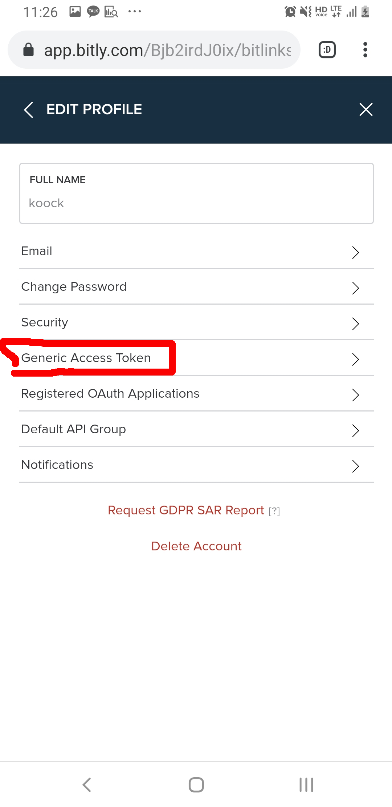

# AutoBitly

this android app is auto shorten URL(bitly) service when you copy any URL

## how to use

1. First, go to <https://bit.ly/>
2. Click menu navigation   
</img>   
3. Log in bit.ly, if you have not account bitly, you have to sign up   
</img>   
4. Click menu navigation again   
</img>   
5. Go to acocunt menu   
</img>   
6. Click "generic access token" menu   
</img>   
7. Input your password bitly again and Click "generate Token" button   
</img>   

### Finally, copy and input your token and on the switch
</img>   

now, you url copied is changed by this app run background 